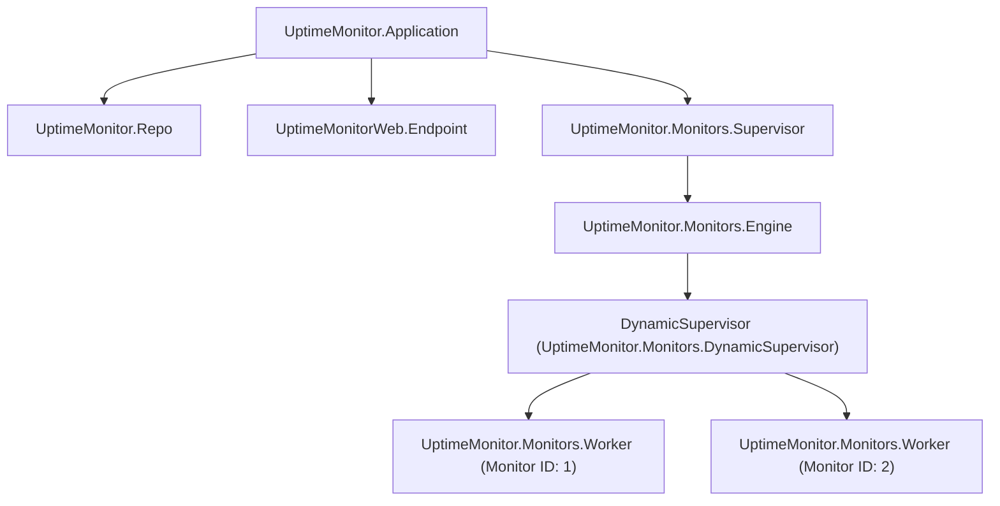

# UptimeMonitor

A high-performance, multi-tenant Uptime Monitor written in **Elixir**, built on top of **Phoenix v1.8** and **Phoenix LiveView v1.2**. This application is engineered following the most rigorous standards of concurrency, fault tolerance, and clean code architecture in the Elixir/OTP ecosystem.

---

## Key Features

*   **Native Multi-Tenancy:** Complete data isolation per organization (Tenant). Each Tenant has their own workspace, team members, and configurations.
*   **Members and Permissions:** Role-Based Access Control (RBAC) with specific levels of authorization to manage the organization:
    *   `Owner`: Full control over the account, subscription management, security settings, and Tenant deletion.
    *   `Admin`: Management of organization members, invitations, global monitor configurations, and alert integrations.
    *   `Editor`: Ability to create, edit, pause, or delete uptime monitors and configure alert thresholds.
    *   `Viewer`: Read-only access to view service status, response latency, and historical uptime reports.
*   **Multiple Monitors per Tenant:** Configure multiple monitoring targets for each organization, including:
    *   HTTP/HTTPS checking.
    *   Highly customizable verification frequencies (from 30 seconds to 24 hours).
    *   Flexible assertions: HTTP status codes, latency thresholds (timeouts), and presence of keywords in the response body.
*   **Real-Time Interactive Dashboard:** Dynamic updates of states, response graphs, and downtime/recovery events using Phoenix LiveView without full-page reloads.
*   **Alerts and Notification Channels:** Integrated channels to notify team members immediately of downtime or restoration events:
    *   Email (powered by Swoosh).
    *   Custom outgoing webhooks.
    *   Slack, Discord, and Telegram integrations (future support).
*   **OTP Concurrent Design:** Ultra-efficient scheduling and execution of checks using `Task.async_stream/3` with back-pressure control and high-performance HTTP clients built on `Req`.

---

## Tech Stack

*   **Language:** [Elixir v1.15+](https://elixir-lang.org/)
*   **Web Framework:** [Phoenix v1.8.8](https://www.phoenixframework.org/) (with LiveView v1.2.0 for real-time reactivity)
*   **Database & ORM:** PostgreSQL and [Ecto v3.13+](https://hexdocs.pm/ecto/Ecto.html) with multi-tenant query capabilities.
*   **HTTP Monitoring Client:** [Req v0.5+](https://hexdocs.pm/req/Req.html) (modern, resilient HTTP client).
*   **Styling & UI:** Tailwind CSS v4 for a premium, fluid, and responsive design.

---

## System Architecture (OTP & Database)

### Monitoring Supervision Tree

Availability checks are structured to be highly fault-tolerant, utilizing dynamic supervisors to isolate individual monitor check processes. If a network request fails catastrophically, it will not affect other monitors or crash the application.



### Multi-Tenant Database Isolation

To ensure security and data privacy for each organization, the database implements multi-tenant isolation via Ecto query scoping backed by compound indexes and foreign key constraints:

*   **`tenants` table**: Stores individual tenants (organizations).
*   **`memberships` table**: Maps users to tenants with specific roles (`owner`, `admin`, `editor`, `viewer`).
*   **`monitors` table**: Each monitor record has a `tenant_id` foreign key. All read and write operations are scoped using this identifier within the application context, preventing cross-tenant data leaks.

---

## Prerequisites

Ensure you have the following installed on your machine:

*   Elixir v1.15 or higher
*   Erlang/OTP 26 or higher
*   PostgreSQL 14 or higher

---

## Setup & Installation

Follow these steps to spin up the local development environment:

1.  **Clone the repository:**
    ```bash
    git clone https://github.com/DiegoRiveraEstefano/Uptime-Monitor.git
    cd Uptime-Monitor
    ```

2.  **Install dependencies and setup the database:**
    This command downloads Elixir dependencies, builds Tailwind/Esbuild assets, and runs database migrations with initial seed data:
    ```bash
    mix setup
    ```

3.  **Start the Phoenix server:**
    Run the server directly or start it within an interactive Elixir shell (IEx):
    ```bash
    # Standard server run
    mix phx.server

    # Or inside interactive Elixir shell (Recommended for development/debugging)
    iex -S mix phx.server
    ```

4.  **Access the application:**
    Open your browser and navigate to [http://localhost:4000](http://localhost:4000).

---

## Testing & Code Quality

The project comes equipped with a comprehensive test suite and code quality/formatting tools.

### Running Tests
To run tests against a clean database instance:
```bash
mix test
```

### Pre-commit Verification
Before committing or pushing changes to the repository, it is highly recommended to run the `precommit` mix alias. It checks for compilation warnings, removes unused dependencies, formats the code, and runs the entire test suite:
```bash
mix precommit
```

This alias executes the following pipeline:
1.  `compile --warnings-as-errors`: Compiles the codebase, treating warnings as errors.
2.  `deps.unlock --unused`: Cleans up unused dependencies from `mix.lock`.
3.  `format`: Verifies and applies standard Elixir code formatting.
4.  `test`: Runs unit and integration tests safely.

---

## Development Guidelines (Best Practices)

This project strictly adheres to the core guidelines of the Elixir and Phoenix ecosystems:

*   **Immutability & Rebinding:** We respect functional principles. We do not rebind variables inside conditional blocks (e.g., `if`, `case`, `cond`). Instead, bind the return value of the block to the variable.
*   **Modern Form Handling:** We use the modern `to_form/2` syntax assigned from the LiveView module to the socket and consumed as `@form[:field]` in HEEx templates. The deprecated `let={f}` or `form_for` helpers are forbidden.
*   **LiveView Streams:** Monitor list and event collections are managed via Phoenix LiveView Streams (`stream/3` and `stream_insert/4`) to keep memory footprint low and prevent server crashes under high data volume.
*   **Resilient Concurrency:** Availability checks are performed concurrently using `Task.async_stream/3` with custom back-pressure limits, ensuring we never overload the machine's file descriptors or network interfaces.
*   **Type Safety:** `String.to_atom/1` must never be called dynamically on user input to avoid memory leaks on the Erlang VM (BEAM).
