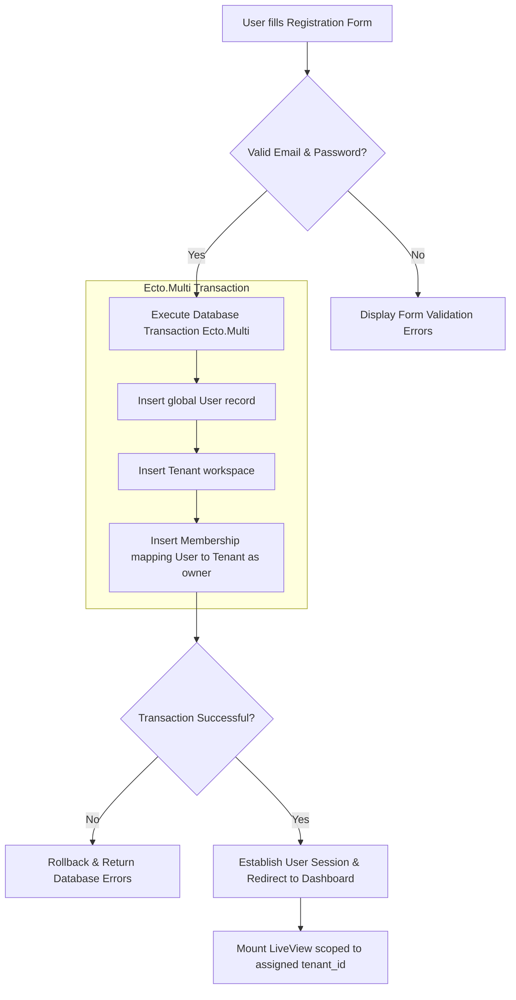
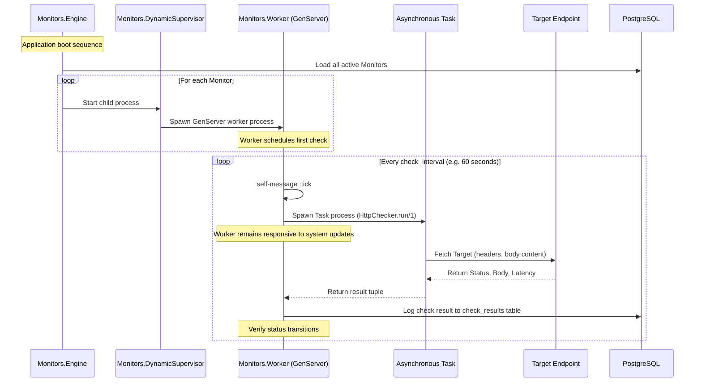
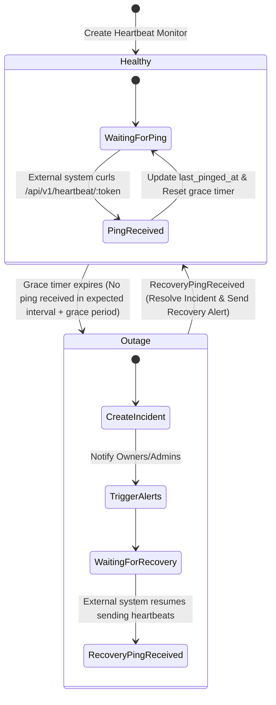
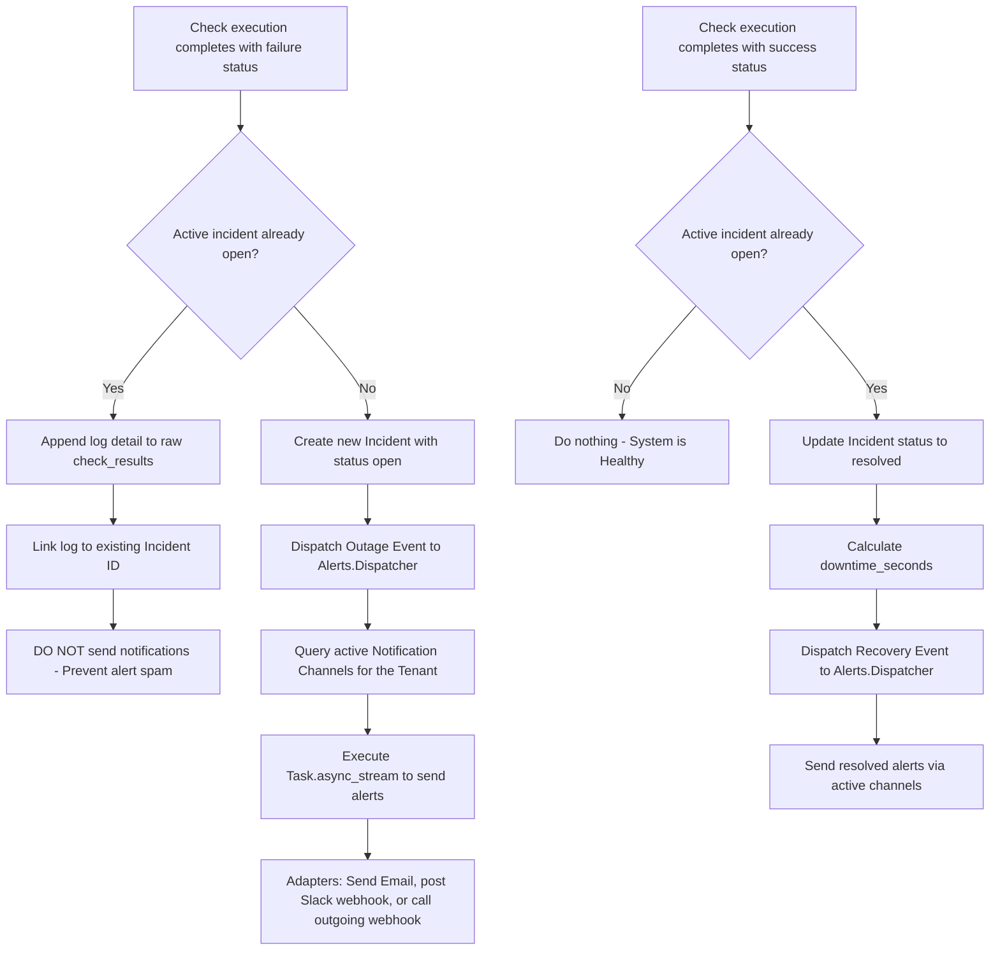
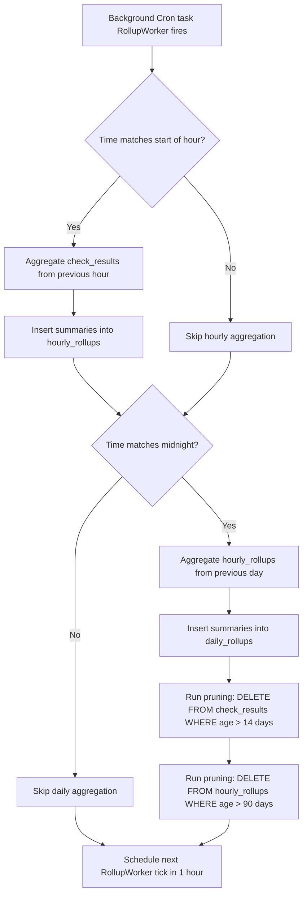

# Application Workflows & Flowcharts

This document defines the core business flows and execution paths for the `UptimeMonitor` platform using Mermaid diagrams.

---

## 1. User Registration & Tenant Creation Workflow

This workflow represents how new users sign up and initialize their isolated organization workspaces.

---

## 2. Active HTTP Monitor Lifecycle Loop

This sequence diagram details how the scheduler dynamically spawns check processes on startup and runs the recursive checking loop.

---

## 3. Passive Heartbeat Watchdog Workflow

This state diagram represents the passive "backward" monitoring watchdog which monitors incoming external heartbeat signals (e.g. from cronjobs).

---

## 4. Incident Lifecycle & Alert Dispatching Flow

This flowchart describes how outages are detected, aggregated, and reported without spamming team members.

---

## 5. Metrics Rollup & Pruning Loop

This flowchart represents the automated database optimization process that summarizes logs and purges raw records.

