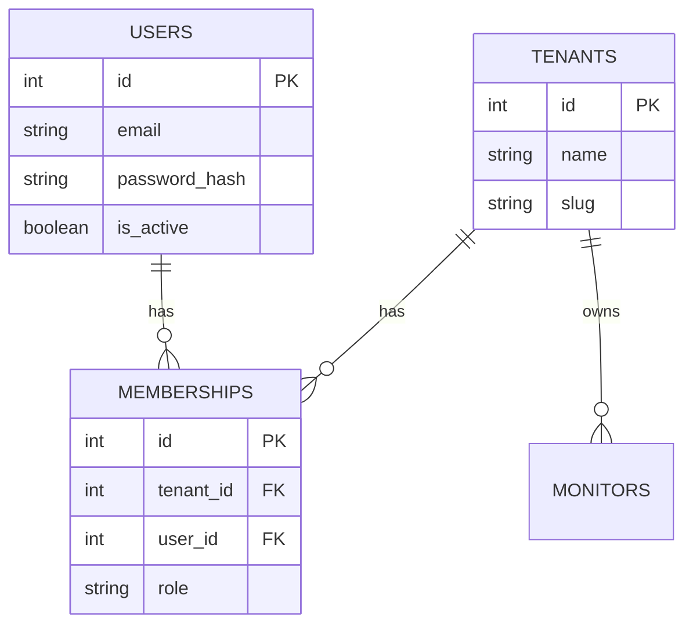

# System Spec 01: Multi-Tenancy & Access Control

This specification defines the multi-tenant architecture, member permission rules, and data scoping strategies for the `UptimeMonitor` project.

---

## 1. Objectives

*   Enforce strong logical data boundaries between different organizations (tenants).
*   Provide a secure Role-Based Access Control (RBAC) system for organization members.
*   Ensure that no user can access, query, or modify resources belonging to another tenant.
*   Allow users to belong to multiple tenants with different roles in each.

---

## 2. Core Concepts & Data Model

### Entities

1.  **User**: A global identity representing a person who can authenticate with email and password.
2.  **Tenant (Organization)**: A business entity that owns resources (Monitors, Status Pages, Incidents).
3.  **Membership**: A join table mapping a `User` to a `Tenant` with a designated `Role`.



### Database Schema Definitions (Ecto)

#### Users Table
*   `id` (Primary Key)
*   `email` (String, unique, null: false)
*   `password_hash` (String, null: false)
*   `is_active` (Boolean, default: true)

#### Tenants Table
*   `id` (Primary Key)
*   `name` (String, null: false)
*   `slug` (String, unique, null: false) - Used for tenant-scoped routing and public status page URLs.

#### Memberships Table
*   `id` (Primary Key)
*   `tenant_id` (Foreign Key referencing `tenants`, null: false, on delete: delete_all)
*   `user_id` (Foreign Key referencing `users`, null: false, on delete: delete_all)
*   `role` (String, null: false) - Values: `"owner"`, `"admin"`, `"editor"`, `"viewer"`

---

## 3. Role-Based Access Control (RBAC) Matrix

We enforce four roles within a Tenant's membership scope:

| Feature / Action | Owner | Admin | Editor | Viewer |
| :--- | :---: | :---: | :---: | :---: |
| **Manage billing/subscription** | ✅ | ❌ | ❌ | ❌ |
| **Delete Tenant** | ✅ | ❌ | ❌ | ❌ |
| **Invite/Remove members** | ✅ | ✅ | ❌ | ❌ |
| **Update member roles** | ✅ | ✅ | ❌ | ❌ |
| **Manage integrations / Webhooks** | ✅ | ✅ | ❌ | ❌ |
| **Create/Edit/Delete Monitors** | ✅ | ✅ | ✅ | ❌ |
| **Pause/Resume Monitors** | ✅ | ✅ | ✅ | ❌ |
| **Create/Edit Post-mortems** | ✅ | ✅ | ✅ | ❌ |
| **View Dashboard & Metrics** | ✅ | ✅ | ✅ | ✅ |
| **View Incidents & Logs** | ✅ | ✅ | ✅ | ✅ |

---

## 4. Query Scoping and Execution Rules

To prevent cross-tenant data leaks, all repository queries fetching tenant resources (Monitors, Checks, Alertas) must explicitly scope by `tenant_id`.

### Code Convention
1.  **Always extract `current_tenant`**: Controller plugs and LiveView mounting pipelines must retrieve the tenant context from the session/URL and store it in the connection/socket assigns as `@current_tenant`.
2.  **Context Scoping**: Service/Context functions must require the tenant context to build queries:

```elixir
defmodule UptimeMonitor.Monitors do
  import Ecto.Query

  # Valid: scopes queries strictly within the tenant boundary
  def list_monitors(tenant_id) do
    UptimeMonitor.Monitors.Monitor
    |> where([m], m.tenant_id == ^tenant_id)
    |> UptimeMonitor.Repo.all()
  end
end
```

3.  **Indexes**: All foreign-key tables must define compound indexes such as `[:tenant_id, :id]` to optimize lookup performance and ensure query isolation at the database level.
