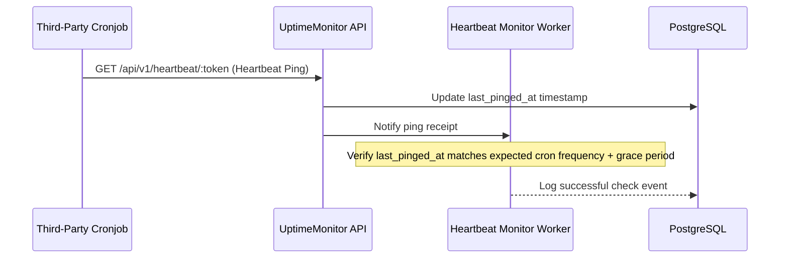

# System Spec 02: Monitoring Engine & Integrity Checks

This specification defines the system architecture, process supervision, and execution flow for active monitoring (HTTP/HTTPS) and passive/heartbeat monitoring (backward monitoring).

---

## 1. Objectives

*   Execute concurrent active availability checks (HTTP/HTTPS) reliably.
*   Support passive/backward monitoring (heartbeats) for cronjobs and external daemons.
*   Safely manage monitoring credentials (headers, bearer tokens, query parameters).
*   Avoid memory ballooning and socket exhaustion under high volumes of targets.

---

## 2. Active Monitoring (HTTP/HTTPS Checks)

Each active monitor represents a target URL that the platform periodically fetches to verify health.

### Check Parameters
*   **Method**: `GET`, `POST`, `PUT`, `HEAD`, `PATCH`.
*   **Timeout**: Custom connection & read timeout (default: 5000ms).
*   **Frequencies**: Check intervals (e.g., 30s, 60s, 5m, 15m, 1h).
*   **Assertions**:
    *   Expected HTTP Status Code (default: `2xx` / `3xx`).
    *   Maximum acceptable response time (e.g. latency must be `< 1500ms`).
    *   Body patterns (regex or exact match string presence).

### Secure Header & Secret Storage
Monitors often require custom authorization headers, API keys, or basic auth tokens.
*   **Storage**: Headers are stored in a JSONB map column `encrypted_headers` on the `monitors` table.
*   **Encryption**: Values within the database must be encrypted using symmetric AES-256-GCM.
*   **Execution**: Decryption occurs in memory *only* immediately prior to dispatching the request via `Req`.

---

## 3. Passive Monitoring (Heartbeat / "Backward" Checks)

Rather than the engine pinging a target, the target pings UptimeMonitor. This is ideal for background workers, cronjobs, or systems behind strict firewalls.



### Flow and Setup
1.  The user creates a "Heartbeat Monitor" and gets a unique token.
2.  The user configures their cronjob script to ping the endpoint:
    `curl -sS https://uptime.domain.com/api/v1/heartbeats/<token>` at the end of its run.
3.  **Expected Interval & Grace Period**: The monitor expects a ping every $N$ seconds (e.g. 86400 for a daily job), with a grace period of $M$ seconds (e.g. 900 seconds/15 mins).
4.  If no heartbeat is received within the `expected_interval + grace_period`, the GenServer transitions the monitor's state to `DOWN` and raises alerts.

---

## 4. OTP Concurrency & Process Architecture

Availability checks are scheduled and isolated using Erlang/OTP primitives to guarantee fault isolation.

```
UptimeMonitor.Application
 ├── UptimeMonitor.Repo
 └── UptimeMonitor.Monitors.Supervisor
      ├── UptimeMonitor.Monitors.Engine
      └── UptimeMonitor.Monitors.DynamicSupervisor
           ├── UptimeMonitor.Monitors.Worker (Monitor: 1)
           ├── UptimeMonitor.Monitors.Worker (Monitor: 2)
           └── UptimeMonitor.Monitors.Worker (Monitor: 3)
```

### Components

1.  **Engine**: Reads active monitors from the DB at startup and requests the `DynamicSupervisor` to spawn a `Worker` for each. It also handles events when new monitors are added, deleted, paused, or resumed.
2.  **DynamicSupervisor**: Manages the life cycle of individual `Worker` processes.
3.  **Worker**: A `GenServer` created for each active/passive monitor.
    *   **Active Monitor Worker**: Automatically schedules the next tick based on the monitor's check interval. On tick, it spawns an asynchronous Elixir `Task` to run the HTTP request using `Req`.
    *   **Passive Monitor Worker**: Operates a state watchdog. It schedules a check at `expected_interval + grace_period` from the `last_pinged_at` timestamp. If that time passes without an updated heartbeat, it triggers the transition to `DOWN`.

### Socket & System Resilience
*   **Connection Pooling**: HTTP checks use a dedicated `Finch` connection pool to reuse sockets and prevent operating system file descriptor limits from being reached.
*   **Asynchronous Processing**: The Worker process itself does not execute network requests. It delegates them to short-lived `Task` processes, remaining responsive to system management commands.
